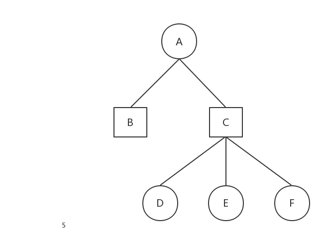
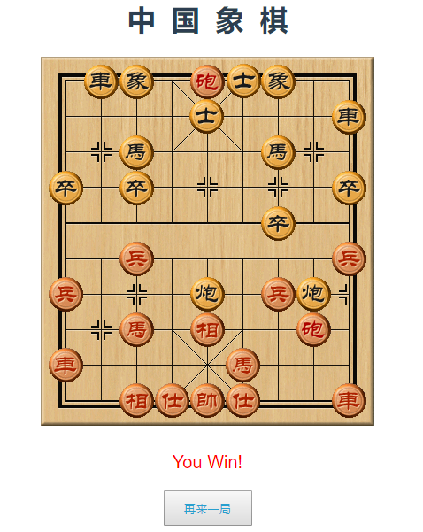

# 中国象棋博弈
## 棋盘表示
中国象棋的棋盘为`10*9`的矩形，一般采用`10*9`的二维数组来表示。
```javascript
chessBoard: [
  ["BR1","BN1","BB1","BA1","BK","BA2","BB2","BN2","BR2"],
  [0, 0, 0, 0, 0, 0, 0, 0, 0],
  [0,"BC1", 0, 0, 0, 0, 0,"BC2", 0],
  ["BP1", 0,"BP2", 0,"BP3", 0,"BP4", 0,"BP5"],
  [0, 0, 0, 0, 0, 0, 0, 0, 0],
  [0, 0, 0, 0, 0, 0, 0, 0, 0],
  ["RP1", 0,"RP2", 0,"RP3", 0,"RP4", 0,"RP5"],
  [0,"RC1", 0, 0, 0, 0, 0,"RC2", 0],
  [0, 0, 0, 0, 0, 0, 0, 0, 0],
  ["RR1","RN1","RB1","RA1","RK","RA2","RB2","RN2","RR2"]
],
```
我使用javascript语言实现，在期盼表示中，直接使用各个棋子的id，空位则使用数字0表示。棋盘大小为10*9的二维数组，边界判断并未使用扩展棋盘的方法，使用通过棋子坐标来判断该棋子是否位于棋盘内。
```javascript
(y >= 0 && y < 10) && (x >= 0 && x < 9) //图形化界面中x，y与二维数组x，y刚好相反
```

## 着法生成
着法生成主要是用来判断用户的着法是否正确，以及生成的计算机的所有着法，并从中选择最好的着法。下边代码展示了判断每个棋子走位是否符合要求的代码（主要展示了兵、炮）的着法，其他棋子按照各自的规则即可。

```javascript
validMove: function(chessBoard, id, from, to) {
  switch(id.slice(0, 2)) {
    // 兵
    case "RP":
      if(to.x === from.x && from.y - to.y === 1) {
        return true
      } else if (to.y === from.y && Math.abs(to.x - from.x) === 1) {
        if(from.y < this.redRiverDimen) {
          return true
        }
      }
      return false
    case "BP":
      if(to.x === from.x && from.y - to.y === -1) {
        return true
      } else if (to.y === from.y && Math.abs(to.x - from.x) === 1) {
        if(from.y > this.blackRiverDimen) {
          return true
        }
      }
      return false
    // 砲
    case "RC":
    case "BC":
      if(to.x == from.x || to.y == from.y) {
        let count = 0
        if(to.x == from.x) {
          let res = this.min_max(from.y, to.y)
          for(let i=res.min + 1; i<res.max; i++) {
            if(chessBoard[i][to.x] != 0) {
              count++
            }
          }
        } else {
          let res = this.min_max(from.x, to.x)
          for(let i=res.min + 1; i<res.max; i++) {
            if(chessBoard[from.y][i] != 0) {
              count++
            }
          }
        }
        if(this.getTarget(chessBoard, to) != null) {
          if(this.getTarget(chessBoard, to).id[0] === this.opponent[id[0]]) {
            return count == 1
          } else {
            return false
          }
        } else {
          return count == 0
        }
      }
      return false
    // 車
    case "RR":
    case "BR":
      // 同行、同列
    // 馬
    case "RN":
    case "BN":
      if(this.getTarget(chessBoard, to)!=null) {
        if(this.getTarget(chessBoard, to).id[0] === id[0]) {
          return false
        }
      }
      // 顺时针：上(上左、上右)、右（右上、右下）、下（下右、下左）、左（左下、左上）
      ...
    // 相
    case "RB":
    case "BB":
      // 不能过河
      // 顺时针: 右上、右下、左下、左上
      ...
    // 仕
    case "RA":
    case "BA":
      // 不能出九宫
      // 顺时针：右上、右下、左下、左上
      ...
    // 帥
    case "RK":
    case "BK":
      // 不能出九宫
      // 顺时针：上、右、下、左
      ...
  }
  return false
},
```

## 玩家移动

玩家移动主要由以下四种情况：

1. 选中红方棋子
2. 已有选中的棋子，落子位置有其他本方棋子
3. 已有选中的棋子，落子位置为黑方棋子
4. 已有选中的棋子，落子位置没有棋子

```js
imgClick: function(event) {
    let from = {}, to = {} 
    if(this.selected == null && event.target.id.indexOf("R") === 0) {
        console.log("select")
        event.target.className = "OOS"
        this.selected = event.target
        return
    } else if (this.selected != null && event.target.id.indexOf("R") === 0) {
        console.log("change select")
        if(this.selected.id != event.target.id) {
            event.target.className = "OOS"
            this.selected.className = ""
            this.selected = event.target
        } else {
            this.selected.className = ""
            this.selected=null
        }
    } else if(this.selected != null && event.target.id.indexOf("B") === 0) {
        console.log("try to eat")
        from = this.formatPos({"x": this.selected.offsetLeft + this.chessWidth/2, "y": this.selected.offsetTop + this.chessWidth/2})
        to = this.formatPos({"x": event.target.offsetLeft + this.chessWidth/2, "y": event.target.offsetTop + this.chessHeight/2})
        if(this.validMove(this.chessBoard, this.selected.id, from, to)) {
            this.move(this.selected, from, to)
            this.selected.className = ""
            this.selected = null
            this.updateDepth()
            if(this.end) {
                return
            }
            setTimeout(()=>{
                this.robot()
                this.turnToPlayer = true
            }, 0)
        }
    } else if(this.selected != null) {
        console.log("move")
        from = this.formatPos({"x": this.selected.offsetLeft + this.chessWidth/2, "y": this.selected.offsetTop + this.chessWidth/2})
        to = this.formatPos({"x": event.layerX, "y": event.layerY})
        if(this.validMove(this.chessBoard, this.selected.id, from, to)) {
            this.move(this.selected, from, to)
            this.selected.className = ""
            this.selected = null
            this.updateDepth()
            this.turnToPlayer = false
            if(this.end) {
                return
            }
            setTimeout(()=>{
                this.robot()
                this.turnToPlayer = true
            }, 0)
        }
    }
```

## 搜索算法

### 最小值-最大值搜索搜索

对于博弈的双方，我们每走一步棋自然会选择对自己最有利而对对方最不利的着法。以黑方为例，假设黑方走一步之后的黑方棋局局势估计值为`blackValue`，而此时红方棋局局势估计值为`redValue`，此时整个棋局局势估计值对黑方而言可以为`blackValue-redValue`，黑方自然希望这个值最大，而对于红方而言，自然希望选择这个值最小的走法。如此交替，便是最小-最大搜索。以下图为例：正方形为黑方，圆形为红方，图形下方数字即为`blackValue-redValue`，图形中A、B等字母表示当前的棋盘局势标识或选择的着法。


上图中，当前棋盘局势为A，黑方有B、C两种着法，其自然是选择B、C中棋局局势对自己最有利的，及`balckValue-redValue`最大；假设已知走法B的棋局估计值为7，现在进行走法C的计算，对于红方，当前棋局局势为C，由三种可选走法D、E、F，其自然选择`balckValue-redValue`最小的为自己的走法，所以选择-5，也就是走法D。此时棋局局势C的估计值为-5。至此对于黑方而言，肯定选择走法B，因为棋局对自己更加有利。

通过以上分析可知，黑方每走一步，都需要将红方可能走的所有情况进行计算求局势估计值，相同的，红方每走一步，都需要将黑方可能走的所有情况进行计算求局势估计值，所以，随着搜索深度的增加，棋盘的局势个数呈指数级的增长，在有限的时间内，我们只能够搜索有限的步骤数。

此时，我们可以利用`alpha-beta`剪枝进行优化。

### alpha-beta剪枝优化

在上述黑方走动的过程中，我们计算了红方所有可能的着法，事实上，当我们求得了局势B的估计值7之后，我们便可以进行一些剪枝，比如：对于局势C，红方有三种不同的选择，并且我们知道红方的选择是`min(D,E,F)`，在我们搜索到D之后，我们发现D的局势估计值为-5，此时我们还有必要获得E和F的局势估计值吗？答案是否定的，因为此时C的选择最大不会大于-5，而-5<7，我们已经可以知道A的选择一定时C。E、F被我们进行了“剪枝”，即为`alpha剪枝`。


下面来看一下`beta剪枝`，对于上图所示的情况，红方当前处于棋局局势为A情况，红方与有B与C两种着法，已经计算着法B的的局势估计值为-10，接下来计算着法C的局势估计值：对于黑方，会选择二D、E、F中最大的局势估计值，但是，当我们得到局势E的估计值2之后，便会知道C的选择最小不会小于2，而2>-10，我们已经可以知道A的选择一定是B。F被我们进行了“剪枝”，即为`beta剪枝`。

`alpha-beta剪枝`代码如下：
```javascript
robotNextStep: function(chessBoard, turn, alpha, beta, step) {
  // 当搜索深度大于预设的深度是退出搜索
  if(step >= this.depth) {
    return this.evaluation(chessBoard)
  }
  let value, nextStep = {}, from
  for(let i=0; i<10; i++) {
    for(let j=0; j<9; j++) {
      if(chessBoard[i][j] == 0) {
        continue
      }
      if(chessBoard[i][j].indexOf(turn) === 0) {
        from = {"x": j, "y": i}
        let [...tos] = this.generateNextStep(chessBoard, from), temp
        for(let k=0, len = tos.length; k<len; k++) {
          temp = chessBoard[tos[k].y][tos[k].x]
          this.swap(chessBoard, from, tos[k])
          // alpha剪枝
          if(turn == this.black) {
            value = this.robotNextStep(this.getCopy(chessBoard), this.red, alpha, beta, step+1)
            if(value > alpha) {
              alpha = value
              nextStep.id = chessBoard[tos[k].y][tos[k].x]
              nextStep.from = from
              nextStep.to = tos[k]
            }
            if(alpha > beta) {
              return beta
            }
          } else {
          // beta剪枝
            value = this.robotNextStep(this.getCopy(chessBoard), this.black, alpha, beta, step+1)
            if(value < beta) {
              beta = value
              nextStep.id = chessBoard[tos[k].y][tos[k].x]
              nextStep.from = from
              nextStep.to = tos[k]
            }
            if(beta < alpha) {
              return alpha
            }
          }
          // 注意队规结束之后进行回溯操作
          this.swap(chessBoard, tos[k], from)
          chessBoard[tos[k].y][tos[k].x] = temp
        }
      }
    }
  }
  this.bestStep = nextStep
  return value
}
```
搜索深度定义如下：
```javascript
// depth初始值为4
updateDepth: function() {
    let count = 0
    for(let i=0; i<10; i++) {
        for(let j=0; j<9; j++) {
            if(this.chessBoard[i][j] != 0) {
                count++
            }
        }
    }
    if(count < 8) {
        this.depth = 6
    } else if(count < 15) {
        this.depth = 5
    }
    return count
},
```

## 棋局评估
- 棋子棋力
- 棋子位置
- 棋子机动性（控制力）
机动性值是棋子的活动范围的度量，通 常棋子的活动范围越大，其机动性也越好，而 对棋盘的控制范围则是一个棋子的合法着法的 范围内，可以通过双方控制该位置的棋子数量 及棋子价值来决定哪方的机动性占优。
- 棋子相互关系
棋子相互关系是指在当前棋盘局势中，存在某个棋子可以吃掉对方棋子，以及某个棋子可以保护另外一个棋子的现象。
在此我们只实现了棋子棋力和棋子位置相关的棋局评估，棋子控制力和棋子相互关系有些复杂并未实现：
### 棋子子力
在设置棋子子力时，将和帅的棋力设为一个较大的值，因为将和帅两方中有一个被吃则游戏结束。
```javascript
// 棋子子力表
chessValue: {
  "K": 100000,  // 将、帅
  "A": 110,     // 仕、士
  "B": 110,     // 相、象
  "N": 300,     // 马、馬
  "R": 500,     // 车、車
  "C": 300,     // 炮、砲
  "P": 100      // 兵、卒
}
```
### 棋子位置
对于同一个棋子，位置不同，其价值也有所不同，比方说，过河卒子要比未过河的价值高得多。可以给每个不同的兵种在棋盘上的各个位置给出经验评估值，以确保评估的准确性。

```javascript
chessPosValue: {
  'P': [
    [0, 3, 6, 9, 12, 9, 6, 3, 0],
    [18, 36, 56, 80, 120, 80, 56, 36, 18],
    [14, 26, 42, 60, 80, 60, 42, 26, 14],
    [10, 20, 30, 34, 40, 34, 30, 20, 10],
    [6, 12, 18, 18, 20, 18, 18, 12, 6],
    [2, 0, 8, 0, 8, 0, 8, 0, 2],
    [0, 0, -2, 0, 4, 0, -2, 0, 0],
    [0, 0, 0, 0, 0, 0, 0, 0, 0],
    [0, 0, 0, 0, 0, 0, 0, 0, 0],
    [0, 0, 0, 0, 0, 0, 0, 0, 0],
  ],
  'R': [
    [14, 14, 12, 18, 16, 18, 12, 14, 14],
    [16, 20, 18, 24, 26, 24, 18, 20, 16],
    [12, 12, 12, 18, 18, 18, 12, 12, 12],
    [12, 18, 16, 22, 22, 22, 16, 18, 12],
    [12, 14, 12, 18, 18, 18, 12, 14, 12],
    [12, 16, 14, 20, 20, 20, 14, 16, 12],
    [6, 10, 8, 14, 14, 14, 8, 10, 6],
    [4, 8, 6, 14, 12, 14, 6, 8, 4],
    [8, 4, 8, 16, 8, 16, 8, 4, 8],
    [-1, 10, 6, 14, 12, 14, 6, 10, -2],
  ],
  'N': [
    [4, 8, 16, 12, 4, 12, 16, 8, 4],
    [4, 10, 28, 16, 8, 16, 28, 10, 4],
    [12, 14, 16, 20, 18, 20, 16, 14, 12],
    [8, 24, 18, 24, 20, 24, 18, 24, 8],
    [6, 16, 14, 18, 16, 18, 14, 16, 6],
    [4, 12, 16, 14, 12, 14, 16, 12, 4],
    [2, 6, 8, 6, 10, 6, 8, 6, 2],
    [4, 2, 8, 8, 4, 8, 8, 2, 4],
    [0, 2, 4, 4, -2, 4, 4, 2, 0],
    [0, -4, 0, 0, 0, 0, 0, -4, 0],
  ],
  'C': [
    [6, 4, 0, -10, -12, -10, 0, 4, 6],
    [2, 2, 0, -4, -14, -4, 0, 2, 2],
    [2, 2, 0, -10, -8, -10, 0, 2, 2],
    [0, 0, -2, 4, 10, 4, -2, 0, 0],
    [0, 0, 0, 2, 8, 2, 0, 0, 0],
    [-2, 0, 4, 2, 6, 2, 4, 0, -2],
    [0, 0, 0, 2, 4, 2, 0, 0, 0],
    [4, 0, 8, 6, 10, 6, 8, 0, 4],
    [0, 2, 4, 6, 6, 6, 4, 2, 0],
    [0, 0, 2, 6, 6, 6, 2, 0, 0],
  ],
}
```
之后将二者加权综合计算得到总的棋局估计值：


$blackValue = chessValue + chessPosValue*8$

$redValue = chessValue + chessPosValue*8$

$棋局估计值 = blackValue - redValue$


评估函数如下：
```javascript
evaluation: function(chessBoard) {
  let blackValue =0, redValue=0, tos=[], target
  for(let i=0;i<10;i++) {
    for(let j=0;j<9;j++) {
      if(chessBoard[i][j]!=0) {
        if(chessBoard[i][j][0] == this.black) {
          blackValue += this.chessValue[chessBoard[i][j][1]]
          if(this.chessPosValue[chessBoard[i][j][1]] != undefined) {
            blackValue += this.chessPosValue[chessBoard[i][j][1]][9-i][j] * 8
          }
        } else {
          redValue += this.chessValue[chessBoard[i][j][1]]
          if(this.chessPosValue[chessBoard[i][j][1]] != undefined) {
            redValue += this.chessPosValue[chessBoard[i][j][1]][i][j] * 8
          }
          tos = this.generateNextStep(chessBoard, {"x": j, "y": i})
        }
      }
    }
  }
  return blackValue - redValue
}
```
## 棋盘UI
使用web技术来实现棋盘设计，如下图所示：



失败时状态：


## 改进
棋局评估函数还有很大的改进空间，有时会发生黑方已经被将军，但是不保护“将”的情况。
## 参考文献
1.[中国象棋博弈系统实现的关键技术探索_肖秀春](http://kns.cnki.net/KCMS/detail/detail.aspx?dbcode=CJFQ&dbname=CJFDLAST2018&filename=DZRU201815076&uid=WEEvREdxOWJmbC9oM1NjYkZCbDZZZ3FjK2N0b1gybmtCcm1pc014Z0FpNWw=$R1yZ0H6jyaa0en3RxVUd8df-oHi7XMMDo7mtKT6mSmEvTuk11l2gFA!!&v=MTMwNzh6UElUZlplN0c0SDluTnFvOUNZb1I4ZVgxTHV4WVM3RGgxVDNxVHJXTTFGckNVUkxLZVplUm5GeTdrVmI=)

2.[基于博弈树搜索算法的中国象棋游戏的设计与实现_刘淑琴](http://kns.cnki.net/KCMS/detail/detail.aspx?dbcode=CJFQ&dbname=CJFDLAST2017&filename=ZDYY201710036&uid=WEEvREdxOWJmbC9oM1NjYkZCbDZZZ3FjK2N0b1gybmtCcm1pc014Z0FpNWw=$R1yZ0H6jyaa0en3RxVUd8df-oHi7XMMDo7mtKT6mSmEvTuk11l2gFA!!&v=MTg1NTM0OUdZb1I4ZVgxTHV4WVM3RGgxVDNxVHJXTTFGckNVUkxLZVplUm5GeTdrV3I3T1B5blNkN0c0SDliTnI=)